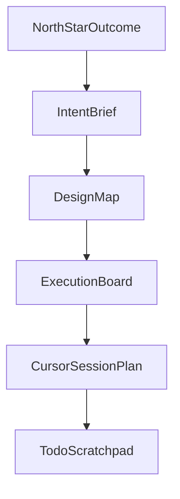
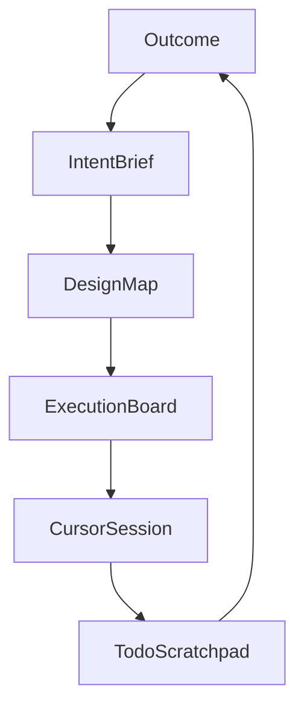

Cursor doesn’t just accelerate coding — it compresses thinking loops. Without a planning stack, speed turns into chaos: more experiments, more refactors, more context switching… and less clarity.

This post introduces the **🟡 Golden Planning Stack**: a lightweight, AI-first planning system designed for Cursor-style development that keeps **direction, intent, and architecture** intact while throughput increases.

> This is not Agile theory, Scrum mechanics, or Jira process. It’s a pragmatic layering of intent + constraints so AI speed doesn’t become entropy.

## Why planning breaks down in Cursor projects

Cursor fundamentally changes how software gets built:

- Idea → working code in minutes
- Refactors feel “free”
- Experiments multiply rapidly
- Context switches happen constantly

Without guardrails, that turns into:

- Exploding TODO lists
- Architecture drift
- Half-formed ideas solidifying into “production”
- Loss of the original **why**

Traditional planning systems (task lists, sprint boards, PRDs) can’t keep up with AI velocity. What you need instead is a **stack** — layers of intent and constraint that absorb speed without collapsing.

## The Golden Planning Stack (Top → Bottom)

Think of this stack as gravity:

- Higher layers define direction
- Lower layers enable speed
- Everything stays aligned



### 1️⃣ North Star Outcome (WHY)

**Question:** What meaningful outcome are we trying to change?

This is not a feature. It’s a measurable change in the world.

**Good examples**

- “Help users decide what to watch in under 30 seconds”
- “Reduce manual operations effort by 60%”
- “Make model fine-tuning reproducible in under one hour”

**Bad examples**

- “Build a dashboard”
- “Add filters”
- “Implement embeddings”

**Rule:** If Cursor generates hundreds of lines of code that don’t move this outcome, the code is noise.

### 2️⃣ Intent Brief (WHAT & BOUNDARIES)

A 1–2 page living document, not a heavy PRD. It defines:

- User/system context
- What success looks like
- Explicit non-goals
- Constraints (time, tech, cost, ethics)

Why this matters with AI: Cursor is powerful, but unopinionated. **The Intent Brief gives it opinions.** Paste it into prompts repeatedly to anchor decisions.

### 3️⃣ Design Map (SHAPE)

Not full architecture — **directional clarity**. Include:

- Core modules
- Data flow
- External dependencies
- Where complexity is allowed vs forbidden

Best formats:

- Markdown bullets
- Mermaid diagrams
- Simple flow sketches

**Rule:** If you can’t explain the design in five minutes, Cursor will invent one for you.

### 4️⃣ Execution Board (NOW)

This is where most projects start — and why they fail.

Use a **Now / Next / Later** structure:

- **Now** → 1–3 active items Cursor is helping you build
- **Next** → clearly defined, not started
- **Later** → parking lot for AI-generated ideas

Each “Now” item must be:

- Small
- Testable
- Explicitly linked to the outcome

**Golden rule:** Cursor writes code. You decide what exists.

### 5️⃣ Cursor Session Plan (MICRO-LOOPS)

This layer is unique to AI-assisted development.

Before each focused Cursor session, define:

- What am I building right now?
- Which files are in scope?
- What must not change?
- What does “done” look like?

This prevents:

- Scope creep
- Accidental rewrites
- “While we’re here…” disasters

Think of this as **prompt hygiene for humans**.

### 6️⃣ TODO & Scratchpad (EXHAUST PORT)

This is where ideas go so they don’t distract you. Capture:

- Raw TODOs
- Cursor suggestions
- “We should also…”
- Half-baked improvements

Most of this should never reach the Execution Board.

**Rule:** A good planning system absorbs ideas without obeying them.

## The Golden Loop



↺ Weekly reflection back to Outcome.

## Minimal practical setup

You don’t need complex tools. A simple repo structure works:

```text
/docs/intent.md
/docs/design.md
/docs/decisions.md
/docs/scratchpad.md
```

Execution board options:

- GitHub Issues
- GitHub Projects
- Todoist (Now / Next / Later)

Cursor lives **inside** this system, not above it.

## Common failure modes (and fixes)

- “Cursor will figure it out” → write a clearer Intent Brief
- Too many TODOs → promote fewer items into “Now”
- Over-engineering early → Design Map, not full architecture
- Lost context after time away → refresh Intent Brief + Decision Log

## Final thought

Cursor gives you near-infinite acceleration. The Golden Planning Stack gives you direction. Without both, you’re just moving very fast — in random directions.

If you want next steps, this framework can be extended into:

- A reusable repo template
- A Cursor prompt pack per layer
- Variants for solo dev, startups, or enterprise teams

Happy to build those out next.
